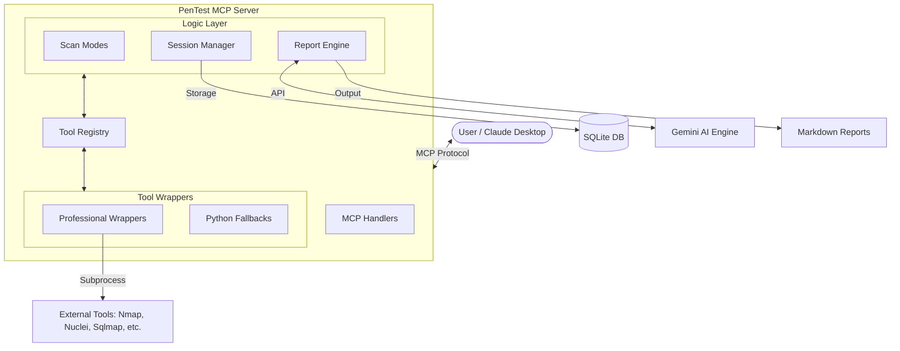

# 🛡️ PenTest MCP

**AI-Powered Security Scanning via Model Context Protocol (MCP)**

PenTest MCP is a specialized MCP server that exposes 25+ professional security tools to AI agents like Claude Desktop. It enables security researchers and developers to orchestrate penetration testing through natural language, automating complex tool chains and generating professional reports.

[](https://www.python.org/)
[](https://modelcontextprotocol.io/)
[](LICENSE)

---

## 🚀 Quick Start (Claude Desktop)

1. **Install dependencies:**
   ```bash
   pip install -e .
   ```

2. **Configure Claude Desktop:**
   Add the following to your `claude_desktop_config.json`:
   ```json
   {
     "mcpServers": {
       "pentest": {
         "command": "python3",
         "args": [
           "-m",
           "pentest_mcp.mcp_server"
         ],
         "cwd": "/absolute/path/to/pentest-mcp"
       }
     }
   }
   ```

3. **Restart Claude Desktop** and start scanning:
   - "Initialize a security assessment for http://localhost:3001"
   - "Run a quick scan on http://localhost:3001 with consent"
   - "Check if the site has a WAF"
   - "Generate the final security report"

---

## 🏗️ Architecture



---


- **Claude Desktop Integration** - Full orchestration via the Model Context Protocol.
- **25+ Security Tools** - Including `nmap`, `sqlmap`, `nuclei`, `ffuf`, `nikto`, `testssl`, and more.
- **Natural Language Orchestration** - Ask security questions, Claude picks the right tools.
- **Preset Scan Modes** - Quick Triage and Extensive Assessment modes.
- **AI-Generated Reports** - Professional markdown reports powered by Gemini AI.
- **CVE Enrichment** - Findings are automatically cross-referenced with CVE data.

---

## 🛠️ Supported Tools (25)

| Category | Tools |
|----------|-------|
| **Reconnaissance** | `subfinder`, `wafw00f`, `nmap`, `whatweb`, `amass`, `dnsrecon`, `theharvester` |
| **Vulnerability Scanning** | `nuclei`, `sqlmap`, `dalfox`, `nikto`, `retire`, `commix`, `corscanner`, `graphql_cop` |
| **Web Fuzzing** | `ffuf`, `gobuster`, `wfuzz`, `arjun` |
| **TLS/SSL** | `sslyze`, `testssl` |
| **Advanced/OSINT** | `masscan`, `trufflehog`, `git_dumper`, `jwt_tool` |

---

## 🔧 Installation & Setup

### Prerequisites
- Python 3.11+
- [Gemini API Key](https://aistudio.google.com/apikey) (for reports and analysis)
- (Recommended) External tools installed: `nmap`, `sqlmap`, `ffuf`, `nuclei`, etc.

### Configuration
Create a `.env` file in the project root:
```bash
GEMINI_API_KEY=your_api_key_here
GEMINI_MODEL=gemini-flash-lite-latest
```

---

## 📁 Project Structure

```
pentest-mcp/
├── pentest_mcp/
│   ├── mcp_server.py      # Main MCP server entry point
│   ├── scan_modes.py      # Quick & Extensive scan logic
│   ├── session.py         # Session & DB management
│   ├── report_engine.py   # AI report generation
│   ├── llm_providers.py   # Gemini API integration
│   ├── tools/             # Tool wrappers & logic
│   └── models.py          # Pydantic data models
├── vulnerable-app/        # Local test target (Node.js)
├── reports/               # Generated scan reports
└── pyproject.toml         # Project dependencies
```

---

## 🔒 Security Notice

**This tool is for authorized security testing only.**
- Always obtain explicit written permission before scanning any target.
- Unauthorized testing is illegal and unethical.
- The `consent` flag is a mandatory requirement for all active scanning tools.

---

**Built with** 🐍 Python · 🧠 Gemini AI · 🛡️ MCP
